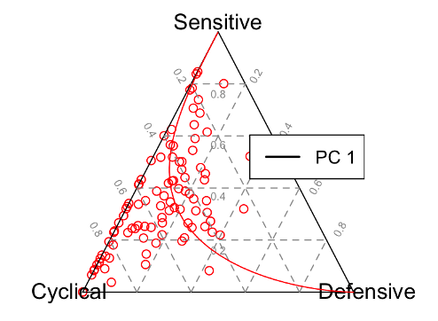
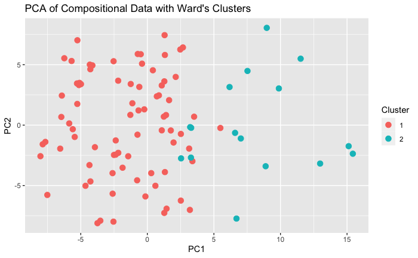
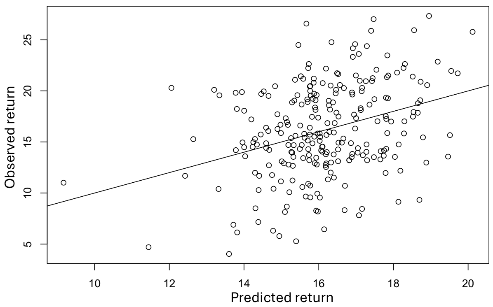
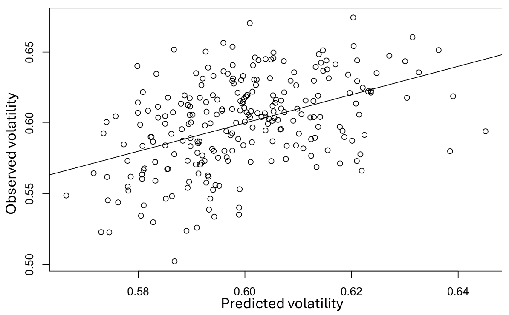

# Compositional Portfolio Analysis

## Overview

This repository contains the code, data, and analysis associated with my MSc Data Science dissertation project investigating the application of mathematical and statistical methods to financial portfolio data, with a particular focus on **Compositional Data Analysis (CoDA)**.

Financial portfolio allocations are naturally compositional in structure because individual asset or sector weights represent relative proportions of a total investment. This project investigates whether treating portfolio allocation data as compositions provides additional analytical, visualisation, and interpretive value compared with conventional approaches.

The work combines mathematical modelling, multivariate statistical analysis, and unsupervised machine learning techniques to evaluate both the potential applications and limitations of compositional methods within quantitative portfolio analysis.

---

## Key Findings

### Superinvestor Portfolio Analysis

Ward hierarchical clustering identified two distinct clusters among the 94 superinvestor portfolios. The clusters appeared to represent relatively **aggressive** and **defensive** investment strategies, providing insight into the sector allocation characteristics associated with these approaches among a group of highly successful investors.

The aggressive cluster was characterised by more uneven sector allocations, with relatively high weightings in **Financial Services** and **Technology**. In contrast, the defensive cluster exhibited more evenly distributed allocations across a wider range of sectors, with a notably higher allocation to **Energy**. Both clusters nevertheless showed substantial exposure to Financial Services, while neither exhibited significant allocations to funds or Utilities.

### Simulated Portfolio Analysis

Compositional regression models quantified the relationship between sector allocation and both portfolio return and volatility. Higher allocations to **Technology** were associated with higher fitted returns and volatility, while **Industrials** was associated with lower fitted returns within the simulated dataset.

The analysis demonstrated that compositional modelling can provide an interpretable way of relating relative sector allocations to portfolio performance characteristics. However, the results also highlighted a trade-off between interpretability and specificity, suggesting that while the methodology can support the comparison of alternative portfolio compositions, it should not be interpreted as a standalone portfolio optimisation or out-of-sample predictive framework.

---

## Methods & Tools

### Data Collection and Construction

* **Python**
* **Jupyter Notebooks**
* Web scraping
* Custom data-generation and processing functions
* Data cleaning and transformation

Two datasets were constructed:

* A dataset containing sector allocation compositions for **94 well-known "superinvestors"**
* A dataset containing **250 simulated portfolios**, including sector allocations, annual returns and annual volatility

### Statistical Analysis

* **R**
* **RStudio**
* **R Markdown**
* Compositional Data Analysis
* Log-ratio transformations
* Principal Component Analysis (PCA)
* Hierarchical clustering using **Ward's method**
* Regression modelling
* Statistical and exploratory visualisation

---

## Selected Figures

The following figures provide an overview of the analysis and key results.

### Ternary Diagram



Portfolio composition: Distribution of the 94 superinvestor portfolios across three aggregated sector groups. Each point represents a portfolio, illustrating the compositional structure and variation in sector allocation. The ternary representation also provides an intuitive visualisation of the relative geometry underlying compositional data, as formalised by Aitchison geometry.

### Principal Components and Portfolio Clusters



Portfolio clustering: PCA was applied to the centred log-ratio (clr) transformed portfolio compositions before hierarchical clustering using Ward's method. The first two principal components provide a two-dimensional representation of the main variation in portfolio composition, with colours indicating the two clusters identified. The separation of the clusters illustrates the distinct allocation patterns underlying the aggressive and defensive investment strategies identified in the analysis.

### Observed vs Fitted Portfolio Returns



Portfolio returns: Observed versus fitted annual portfolio returns from the compositional regression model. The model estimates the relationship between the relative sector composition of each portfolio and its annual return, illustrating how compositional information can be used to explain variation in portfolio performance.

### Observed vs Fitted Portfolio Volatility



Portfolio volatility: Observed versus fitted annual portfolio volatility from the compositional regression model. The model estimates the relationship between the relative sector composition of each portfolio and its annual volatility, illustrating how the same compositional framework can be applied to a measure of portfolio risk.

---

## Repository Structure

```text
├── notebooks/
│   ├── superinvestor_dataset_construction.ipynb
│   └── simulated_portfolio_dataset_construction.ipynb
│
├── data/
│   └── simulated-portfolios.csv
│
├── analysis/
│   ├── superinvestor_analysis.Rmd
│   └── simulated_portfolio_analysis.Rmd
│
├── figures/
│   ├── clusters-ward.png
│   ├── ternary-diagram.png
│   ├── fitted_vs_observed_return.png
│   └── fitted_vs_observed_volatility.png
│
├── report/
│   └── compositional-portfolio-analysis-report.pdf
│
├── README.md
├── LICENSE
└── .gitignore
```

The `notebooks/` directory contains the Python notebooks used to construct the two datasets.

The `data/` directory contains the dataset that can be redistributed.

The `analysis/` directory contains the R Markdown files used for the statistical analysis of each dataset.

The `figures/` directory contains selected figures from the analysis.

The `report/` directory contains the full MSc dissertation.

---

## Data & Reproducibility

The notebooks used for dataset construction and the R Markdown files used for statistical analysis are included to provide transparency and enable reproduction of the research workflow.

One of the datasets was obtained from an external online source. As permission to redistribute this data could not be confirmed, it has not been included in this repository. Users wishing to reproduce this part of the analysis should obtain the data independently from the original source and ensure compliance with any applicable terms of use.

The externally sourced data was obtained from **Valuesider**.

---

## Scope & Limitations

This project focuses on evaluating the usefulness of **Compositional Data Analysis as a statistical framework for analysing financial portfolio data**.

The work is primarily concerned with portfolio structure, allocation relationships, interpretation, and statistical modelling rather than the implementation or comparison of established portfolio optimisation frameworks.

The results therefore provide insight into the analytical value and limitations of compositional representations, while recognising that practical portfolio construction involves additional financial considerations and optimisation methodologies beyond the scope of this study.

---

## Report

The full report provides the theoretical background, detailed methodology, complete statistical analysis, results, discussion, and conclusions underlying this repository.

**[View the full dissertation](report/compositional-portfolio-analysis-report.pdf)**

---

## Author

**Josh Steele**

MSc Data Science  
BSc Mathematics

University of Bath  
2024
